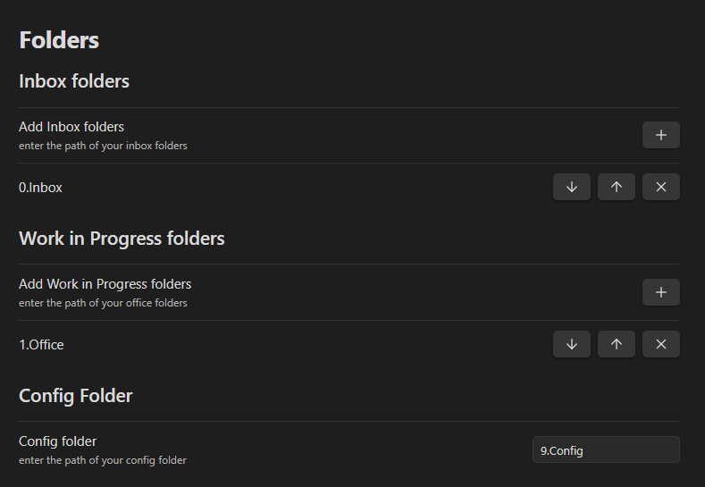
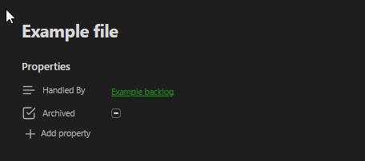
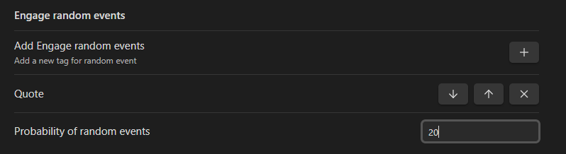
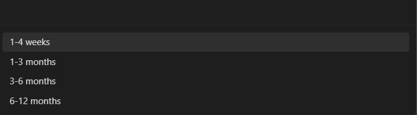
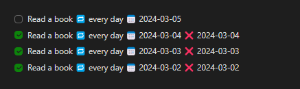
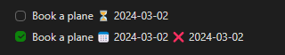

# Obsidian Personal OS

<br>
<div style="display: flex; justify-content: space-between; width: 100%;"><a href="https://github.com/GengAd/obsidian-personal-os" style="display: flex; flex-direction: column; align-items: center; text-align: center; width: 100%;"><svg width="48px" height="48px" viewBox="0 0 24 24" xmlns="http://www.w3.org/2000/svg" fill="none" stroke="currentColor"><path d="M12 .297c-6.63 0-12 5.373-12 12 0 5.303 3.438 9.8 8.205 11.385.6.113.82-.258.82-.577 0-.285-.01-1.04-.015-2.04-3.338.724-4.042-1.61-4.042-1.61C4.422 18.07 3.633 17.7 3.633 17.7c-1.087-.744.084-.729.084-.729 1.205.084 1.838 1.236 1.838 1.236 1.07 1.835 2.809 1.305 3.495.998.108-.776.417-1.305.76-1.605-2.665-.3-5.466-1.332-5.466-5.93 0-1.31.465-2.38 1.235-3.22-.135-.303-.54-1.523.105-3.176 0 0 1.005-.322 3.3 1.23.96-.267 1.98-.399 3-.405 1.02.006 2.04.138 3 .405 2.28-1.552 3.285-1.23 3.285-1.23.645 1.653.24 2.873.12 3.176.765.84 1.23 1.91 1.23 3.22 0 4.61-2.805 5.625-5.475 5.92.42.36.81 1.096.81 2.22 0 1.606-.015 2.896-.015 3.286 0 .315.21.69.825.57C20.565 22.092 24 17.592 24 12.297c0-6.627-5.373-12-12-12"></path></svg><br>Ask anything on Github</a><a href="https://discord.gg/SZrM5ayuTR" style="display: flex; flex-direction: column; align-items: center; text-align: center; width: 100%;"><svg width="48px" height="48px" viewBox="-1.5 0 24 24" xmlns="http://www.w3.org/2000/svg" fill="none" stroke="currentColor"><path d="m13.93 11.4c-.054.633-.582 1.127-1.224 1.127-.678 0-1.229-.55-1.229-1.229s.55-1.229 1.228-1.229c.683.029 1.225.59 1.225 1.277 0 .019 0 .037-.001.056v-.003zm-5.604-1.33c-.688.061-1.223.634-1.223 1.332s.535 1.271 1.218 1.332h.005c.683-.029 1.225-.59 1.225-1.277 0-.019 0-.037-.001-.056v.003c.001-.02.002-.043.002-.067 0-.685-.541-1.243-1.219-1.269h-.002zm12.674-7.598v21.528c-3.023-2.672-2.057-1.787-5.568-5.052l.636 2.22h-13.609c-1.359-.004-2.46-1.106-2.46-2.466 0-.002 0-.004 0-.006v-16.224c0-.002 0-.004 0-.006 0-1.36 1.101-2.462 2.459-2.466h16.081c1.359.004 2.46 1.106 2.46 2.466v.006zm-3.42 11.376c-.042-2.559-.676-4.96-1.77-7.086l.042.09c-.924-.731-2.088-1.195-3.358-1.259l-.014-.001-.168.192c1.15.312 2.15.837 3.002 1.535l-.014-.011c-1.399-.769-3.066-1.222-4.839-1.222-1.493 0-2.911.321-4.189.898l.064-.026c-.444.204-.708.35-.708.35.884-.722 1.942-1.266 3.1-1.56l.056-.012-.12-.144c-1.284.065-2.448.529-3.384 1.269l.012-.009c-1.052 2.036-1.686 4.437-1.728 6.982v.014c.799 1.111 2.088 1.826 3.543 1.826.041 0 .082-.001.123-.002h-.006s.444-.54.804-.996c-.866-.223-1.592-.727-2.093-1.406l-.007-.01c.176.124.468.284.49.3 1.209.672 2.652 1.067 4.188 1.067 1.191 0 2.326-.238 3.36-.668l-.058.021c.528-.202.982-.44 1.404-.723l-.025.016c-.526.703-1.277 1.212-2.144 1.423l-.026.005c.36.456.792.972.792.972.033.001.072.001.111.001 1.461 0 2.755-.714 3.552-1.813l.009-.013z"></path></svg><br>Join Discord server</a><a href="https://discord.gg/SZrM5ayuTR" style="display: flex; flex-direction: column; align-items: center; text-align: center; width: 100%;"><svg width="48px" height="48px" viewBox="0 0 512 512" xmlns="http://www.w3.org/2000/svg" fill="currentColor"><path d="M232 64L280 64 280 214 277 270 300 242 356 189 388 221 256 353 124 221 156 189 212 242 235 270 232 214 232 64ZM64 400L448 400 448 448 64 448 64 400Z"></path></svg><br>Download vault template</a></div>

## Introduction

The Obsidian Personal OS plugin is a powerful addition to Obsidian, designed to optimize your workflow by automating the management of tasks, reviews, and focus areas within your Obsidian environment. By alleviating the burden of decision-making regarding which file to prioritize, the plugin employs an automated selection process to direct your attention efficiently, drawing inspiration from the GTD (Getting Things Done) methodology. However, strict adherence to GTD principles is not mandatory for benefiting from this tool.

##  ⚠️ Prerequisites

This plugin leverages functionality from three community plugins:

- **Dataview**: Essential for database queries.
- **Tasks**: Necessary for task management.

## Features Overview

1. **Engage Command**: Automatically selects the next file that requires an action:
    - Can bring Random Events 
    - Automatically opens the appropriate workspace.
2. **Process Command**: Identifies the next file in need of processing or task creation.
4. **Random Snooze**: Allows for effortless planning by randomly snoozing a file within a specified date range.
5. **Auto Fail Tasks**: Marks tasks as failed for items not completed, useful for recurring tasks during periods of absence.
    - Applicable to the current file or across the entire vault.

## Key Concepts

### Vault Structure

It is recommended that your vault contains at least one "Inbox" folder for new files and a "Work In Progress" folder for items requiring attention. These folder names are customizable and are specified within the plugin settings.

Example : 



#### Inbox Folders

Serve as initial holding areas for unprocessed items. Files in these folders need to be moved elsewhere to be excluded from the "start process" feature. An empty setting implies the entire vault functions as an "Inbox".

#### Work in Progress Folders

Represent areas for active items that are not archived. Items without a "Handled By" property or not marked as "Archived" with at least one next action are considered active (see file anatomy). 
The "Engage" command also only look into the "Work in progress" folders to find actionable files. 
An empty setting designates the entire vault as a "Work in Progress" area.

### File Anatomy

The plugin uses 2 major properties in your files, we advise using the core obsidian "Properties view" plugin  : 

- **"Archived" Property**: (Optional) A True/False flag.
- **"Handled By" Property**: (Optional) Text property linking to another file.

Here is an example : 


#### Rules for "Work in progress" files:

- Non-archived files are active and require at least one task.
- Archived files are inactive and excluded from automatic prioritization.
- A "Handled By" file is active and still requires at least one task, but it's excluded from automatic prioritization.

### Task Anatomy

Understanding dates within tasks is crucial, as they dictate the task's visibility and priority:

- **Start Date**: The earliest date a task becomes relevant.
- **Scheduled Date**: The planned date for task execution.
- **Due Date**: The final deadline for task completion.

#### 🛫Start Date
This date represents the date when you CAN "Start" doing this task. Before that date there is no need for the system to bring the file to your attention, but after that date it will in the "Start Work" command. 

#### ⏳Scheduled Date (or Do Date)
This date represent the date when you SCHEDULED to work on this task. Before that date there is no need for the system to bring the file to your attention, but at the desired date it needs to be brought to attention!
A task having a start date AND a scheduled date will not come before the schedule date. 
A task having a scheduled date in the past is considered **late** but **not failed**. 

#### 📅Due Date
This date represent the ultimate possible date where this task should be finished. Before that date, the file can be brought to your attention if it has a start date or a scheduled date. 
A task having a Due date in the past is considered **late** and **failed**. 

#### ⌚ Time 
It's possible to add a time to a task (before the date and the recurrence). by using the "⌚" emoji (Windows + . on windows). 
A timed task will only be brought to attention after the dedicated time and with a high priority.  Time is in 24h format, here is an example : ⌚15:00 for 3pm.  See Engage feature for more info.

#### Tasks example 
- [ ] Study for exam 🛫 2024-03-05 📅 2024-03-15 

This task means that you "can" study between the 05th and the 15th of March. 
- It will show starting on the 05th and until the 15th
- It will be considered late and failed on the 16th


- [ ] Study for exam⌚15:00 🛫 2024-03-05 ⏳ 2024-03-11 📅 2024-03-15 

This task means that you "Can" study between the 05th and the 15th of March. 
You've scheduled to actually study on the 11th. 
- It won't show before the 11th at 15:00. 
- It will be considered late on the 12th. 
- It will be considered late and failed on the 16th

## Types for files

Some concepts are useful to understand : 
- A **due file** has at least 1 task with a scheduled or due date on the current day. 
- A **Next file** has at least 1 task with a start date in the past OR a file with only non dated tasks. 
- A **late file** is a file with at least 1 task that is scheduled or Due in the past. 

Those concepts are used very often in all the algorithms of the plugin features. 
## Features 
### Engage Command

This feature brings forward files requiring immediate action, prioritizing based on dates, time and priority. 
Engage only brings files that are not archived, not "Handled By" another file, and in a "Work in progress" folder. 
The command uses a very specific algorithm to prioritize files to bring to your attention. 


- Due files with a time (⌚) in the past, ordered by time. 
- Random due file with no time (Random groups are created by priority, the high priority tasks will come first)
- Random next file 

#### Engage Random Event
It is possible to configure "Random Events" tags in the settings. 



Here the Engage feature has a 20% chance to bring a random file from those random events and this value can be configured. 
By default this value is 0%.

#### Engage Automatic Workspace opening
If a file can contain a "Workspace" property containing a Workspace name, when start work brings this file to your attention it will automatically open the referenced workspace. 
Note that when automatically opening a workspace, the previous state of your obsidian is saved in the "OSPrevious" Workspace. 
Also note that on Mobile, this feature only works if a workspace exists with the mention "Mobile" in the name. 

As an example, if a file has the "Workspace" property filled with the value "Work" : 
- On Desktop, the "Work"  Workspace will be opened automatically if it exists.
- On mobile the "Work Mobile" Workspace will be opened automatically if it exists.

This because workspaces between desktop and Mobile still present some issue in Obsidian currently (the left pane is empty for example).


### Process Command
Facilitates vault organization by highlighting files needing review or task assignment, prioritizing late tasks and inbox items.

The priority system for Start process works as follow : 
- Late files 
- Files in 1 of your Inboxes
- Files "In progress without a task ", meaning non archived files in one of your "work in progress" folders that does not have a task defined. 


### Random snooze a file command
Simplifies planning by allowing random postponement of tasks within a chosen timeframe.



It will replace in the current file any start date or scheduled date by a random future date in the chosen interval.


### Auto failing tasks command
Automates the marking of tasks as failed past their due date, maintaining accountability for recurring obligations.
If the task was a recurring task, the command will generate failed task until a current or future date is found. 
If the task was not a recurring task. The due date will be replaced by a scheduled date in the past. The idea is to keep a record of "not doing" the action but the file will still show in your "Late" files while processing so you can choose what to do with it. 

For example this task : 


Will become like this : 



And this task : 


Will become like this : 



It's possible to launch the Auto fail task command either in the current file Or in your whole vault. 

### Engage current file command
Added a command to use the "Engage" algorithm in the context of the current file. Meaning that this algorithm will only look fore files that are  referencing the current file in a "Handled By" property. 

### Add time emoji command
Added a command to add the "⌚" emoji used to declare time on tasks. 

### Calendar Widget
Thanks 702573N for providing the baseline for it !
Check [Obsidian-Tasks-Calendar](https://github.com/702573N/Obsidian-Tasks-Calendar) for more documentation. 

Main change : 
The calendar widget is now declared in the following form in a "Calendar" code block : 
````
```Calendar
pages: ""
view: month
firstDayOfWeek: 1
options: style1
```
````

Instead of  the folowing in a "dataviewjs" code block: 
````
```dataviewjs
await dv.view("9.Archives/z.Obsidian Settings/CalendarView", {pages:"", view: "week", firstDayOfWeek: "1", options: "style4 noProcess noLayer filter"})
```
````

#### Added options

##### taskCountOnly
```
taskCountOnly: true
```
This parameter displays only the number of tasks on each days

##### disableRecurrence
```
disableRecurrence: true
```
Now you can see the recurring tasks every days they will appear in the future, not only the current day, if you want to disable this new feature set this parameter to `true`

##### hideFileWithProps
```
hideFileWithProps: Archived, Handled By
```
This filter will remove the tasks that are not checked and present in a file with a mentioned property, as `Archived` or `Handled By` in this example

#### Calendar block example
````
```Calendar
view: week
firstDayOfWeek: 1
options: style4 noProcess noLayer filter noDailyNote noCellNameEvent
pages: "2.Activities"
hideArchived: true 
hideHandled: true
```
````
### Timeline Widget
Thanks 702573N for providing the baseline for it ! 
Check  [Obsidian-Tasks-Timeline](https://github.com/702573N/Obsidian-Tasks-Timeline) for more documentation


Main change : 
The calendar widget is now declared in the following form in a "Taskido" code block Instead of a "dataviewjs" codeblock : 
````
```Taskido
parameter: "value"
parameter: "value"
parameter: true
parameter: "value value value value"
```
````

#### Added options

##### taskCountOnly
```
taskCountOnly: true
```
This parameter displays only the number of tasks on each days

##### disableRecurrence
```
disableRecurrence: true
```
Now you can see the recurring tasks every days they will appear in the future, not only the current day, if you want to disable this new feature set this parameter to `true`

##### hideFileWithProps
```
hideFileWithProps: Archived, Handled By
```
This filter will remove the tasks that are not checked and present in a file with a mentioned property, as `Archived` or `Handled By` in this example

#### numberOfDays
```
numberOfDays: 5
```
Choose the number of days you want to view in the future in your timeline

#### Timeline block example

````
```Taskido  
pages: "2.Activities"  
disableRecurrence: false  
hideFileWithProps: Archived, Handled By
options: noCounters
options: noQuickEntry
```
````

## Releases 
### 2.0.2 : Release update 

Info : 
- Changed links to new vault template, find it in the official obsidian community or in the Personal OS discord
Nex features : 
- Added function support for Xp and progress calculation. 
- Added Simple profile view (to be improved on)
- Added Command to launch profile view

### 2.0.1 : Release update 

Bug fix : 
- Fixed auto-fail not working in certain timezones. 
- Added fail-safe to auto-fail to prevent infinite loop. 

## Old Releases

### 2.0.0 : Release update 

Info : 
- Changed link to New vault template, you can buy it from the site or find it free in the official Obsidian community ! 
New features :
- Added Calendar and Timeline supports ! Thanks 702573N !
- Added "Engage current file" command 
- Added "Clock emoji" command
Changes : 
- Improved auto-fail using rrule, all types of recurrences managed by the task plugin now work with auto fail ! (try every monday, tuesday for example)
- Improved auto delay, now 2 commands are available, one to generate a date, and one to delay "All dates" in the current file. 
Bug fix : 
- Fixed unexpected behavior on "Done" and "Due done" pages. 

### 1.1.0 : Release update 

Info : 
- Link added in the setting to a New vault template ! filled with dashboards, plugins and tutorials on how to use the Personal OS method !
- Link added in the setting to a discord community if you need any help or want to talk about the Personal OS Vault !
- Link added in the setting to the plugin Github if you notice any bug or have a feature request !
New features : 
- Added Progress Bar in plugin, preventing the need to use external services.
- Added an Engage current file to apply Engage logic to all files "Handled" by the current file
- Added a "Random date" feature to generate a random date between the usual snooze categories.
- Added a Feedback XP notice when finishing tasks,  this can be disabled in the plugin config.
- Added a changelog modal when updating the plugin , this can be disable in the plugin config.
Changes : 
- Changed command names for Start Work and Start Process : Engage + Process
- Improved auto-change workspace by saving previous workspace
- Improved auto-change workspace by selecting a "Mobile" version of the workspace on mobile.
Bug fix : 
- Fix Engage feature to work properly with all tasks priorities
- Fix Random Snooze for due dates
- Fix auto fail current file to include current day. No change on failing all work in progress files.
- Fix done file showing when there were still files later

### 1.0.0: Initial Release

The first release of Personal OS ! 
- New : **Start Work Command**
- New : **Start Process Command**
- New : **Random Snooze**
- New : **Auto Fail Tasks**²
